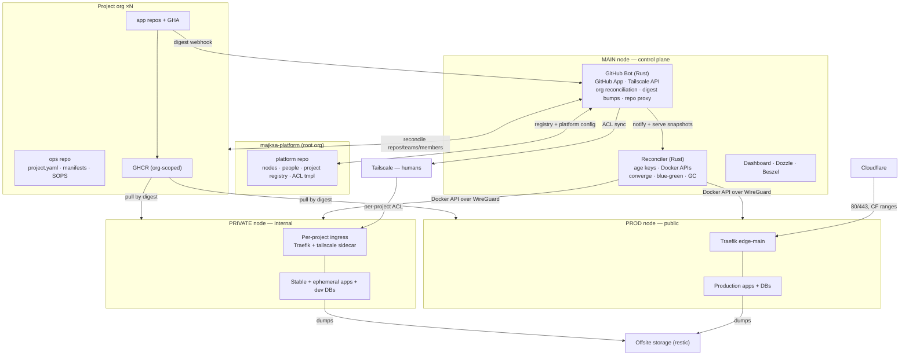
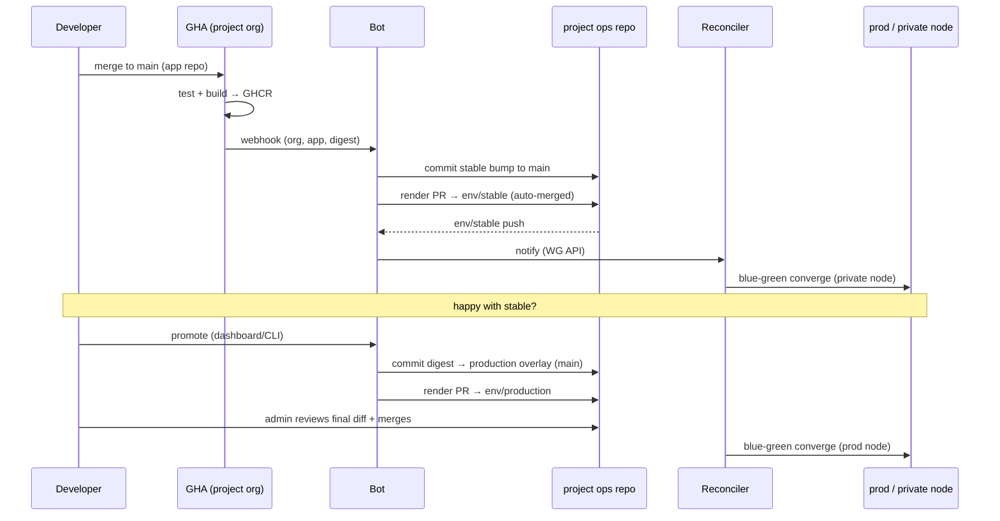
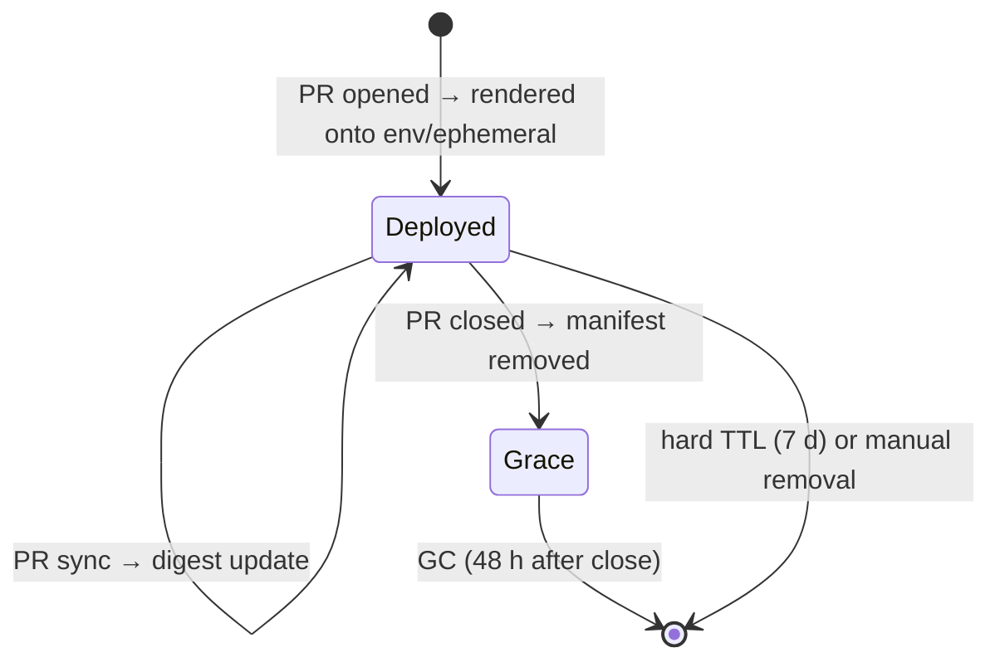

# MajNet v2 — Design Document

**Status:** Final draft v4 · **Author:** Ondrej Maxa · **Date:** 2026-07-03

A self-hosted deployment platform: GitOps-driven, built on **plain Docker** with static trust-zoned placement across three nodes, organized around **projects**. Each project is its own **GitHub organization**, fully managed by the platform. Two custom Rust services — a **GitHub Bot** (the only component talking to GitHub and Tailscale APIs) and a **Reconciler** (the single orchestrator, driving each node's Docker API directly).

---

## 1. Goals

- Deploy applications from project organizations to a small three-node setup with zero manual SSH steps.
- **One GitHub org per project**, each containing one repo per application plus one `ops` repo (config). GitHub state — repos, settings, teams, members, webhooks — is **fully bot-managed and declarative**.
- **Environment classes**: `production` (public, gated), `stable` (VPN, auto-deploy), `ephemeral` (VPN, PR-scoped, TTL).
- **Static placement by trust zone** — workloads never migrate across security boundaries.
- Git as the single source of truth: a root **platform org** for global config, per-project `ops` repos for project config, SOPS-encrypted secrets alongside.
- Managed databases (PostgreSQL, MariaDB, Valkey, MongoDB) with per-project logical DBs/users and automated backups.

**Non-goals (v2.0):** autoscaling, automatic cross-node failover (deliberate trade — §17), custom proxy in the critical path.

## 2. GitHub Model — Org per Project

```
majksa-platform (root org)
└── platform            # nodes.yaml, people.yaml, projects.yaml (registry),
                        # tailscale-acl.tmpl, platform service manifests

<project> org (e.g. zpevnik)          ← one per project
├── ops                 # project.yaml, app manifests, SOPS secrets
├── <app-1>             # application repo
└── <app-2>             # application repo
```

**Registry-gated discovery.** A project exists when **both** hold: the GitHub App is installed on the org, **and** the org is listed in `majksa-platform/platform/projects.yaml`. App installation alone does nothing — a stray install can't join the platform; a registry entry without installation shows as "pending" on the dashboard.

**Fully declarative repos.** Apps declared in a project's `ops` repo are materialized by the bot: it creates missing app repos (from a template: GHA workflow, branch protection, labels), creates the `ops` repo itself for newly registered orgs, and continuously reconciles settings, teams, members, and webhooks against config. Removing an app from config archives its repo (never deletes — archival is the safe terminal state).

**The one manual step:** GitHub.com does not allow programmatic org creation. Bootstrapping a project = create the org by hand + install the App + add one line to `projects.yaml`. Everything after is automated.

## 3. Why plain Docker (not Swarm/k8s)

Topology is static placement by trust zone: every service has exactly one home node. A dynamic scheduler would be fully constrained into doing nothing, and its headline feature — auto-rescheduling across nodes — is actively unwanted (prod workloads must never float onto the dev node). Dropping Swarm removes Raft/quorum/VXLAN and makes the reconciler the single orchestrator.

| Swarm feature | Replacement |
|---|---|
| Scheduling | Static: node follows from environment class |
| Overlay networks | Per-project Docker networks within a node; WireGuard for cross-node traffic |
| Swarm secrets | Reconciler injects secrets as tmpfs-mounted files at container create |
| Rolling updates | Reconciler blue-green: start new → health check → flip Traefik label → stop old |
| Service discovery | Traefik label-based routing per node |

## 4. Topology — 1 main + 2 workers

| Node | Trust zone | Runs |
|---|---|---|
| **main** | control plane | bot, reconciler + its DB, dashboard, Dozzle, Beszel |
| **prod** | public workloads | `edge-main` (Traefik), production apps, production databases |
| **private** | internal workloads | per-project ingresses, stable + ephemeral apps, dev databases |

Data stays inside its trust zone. Node recovery = bootstrap script + restic restore + reconverge from git.

## 5. Decision Log

| Concern | Decision |
|---|---|
| GitHub layout | **Org per project**: app repos + one `ops` repo; root org `majksa-platform` for global config |
| GitHub management | Fully declarative — bot creates/reconciles repos, settings, teams, members, webhooks |
| Project discovery | App installed **and** listed in root registry |
| Orchestration | Plain Docker; reconciler drives node APIs over WireGuard (bollard remote, mTLS) |
| Topology | 1 main + 2 workers (prod, private) — static trust-zoned placement |
| Control plane language | Rust |
| Membership | Declared in project `ops`; bot syncs GitHub org teams **and** Tailscale ACLs |
| Project isolation | Own org, own Docker networks, own DB users, own ingress node |
| Environments | Classes: `production` / `stable` / `ephemeral` |
| Cluster mesh (machines) | Plain WireGuard; Docker APIs only on WG interface |
| Human access (people) | Tailscale — groups, ACLs; per-project ingress joins tailnet as `tag:proj-<name>` |
| Public surface | `edge-main` on prod node, production only |
| SSL | Cloudflare proxied + origin certs, Full (strict) |
| Secrets | SOPS + age; platform key per class + project admins' keys as recipients |
| Updates | Blue-green: health-gated Traefik label flip |
| Builds | GitHub Actions → GHCR (per project org); platform never builds |
| Rollback | `git revert` on `main` + re-render |
| Ops repo layout | `main` = sources; `env/<class>` branches updated via **render PRs** — merge = deploy |
| Production gate | Admin review of the `env/production` render PR (the exact final diff) |
| Dashboard | Read-write UI — all writes become bot-authored commits/PRs; only restart is imperative |
| Databases | Per-project DBs/users; **never on any VPN** — Docker networks only, break-glass via node SSH |

## 6. System Architecture



**Credential isolation:** bot holds GitHub App key + Tailscale API key; reconciler holds age keys + Docker API certs. Disjoint powers.

## 7. Networking — Two Networks, Four Trust Zones

**Cluster mesh (machines): plain WireGuard.** Three static peers. Each node's Docker API listens only on its WG IP, mTLS client certs held by the reconciler.

**Access network (humans): Tailscale.** Groups + ACLs rendered by the bot from platform + project config, pushed via API.

| Zone | Who | How |
|---|---|---|
| Production apps | public internet | Cloudflare → `edge-main` (80/443, CF ranges only) |
| Control plane (webhooks, wizard) | GitHub / installing operator | Caddy on main (80/443, ACME — ADR 0006); plain 8080/7600 only on domain-less installs |
| Stable + ephemeral | project members | Tailscale ACL → that project's ingress (private node) |
| Dashboards, logs, metrics | admins | Tailscale ACL (admin group) → main node |
| Databases | services only | per-project Docker networks — no VPN listener; break-glass = node SSH |

## 8. Environment Classes

The DEV→OPS delivery gradient (ADR 0009): builds (PR/main) are disposable image
bumps; releases (tags `vX.Y.Z`) are immutable, versioned bundles.

| Class | Node | Ingress | Deploy policy | Lifetime |
|---|---|---|---|---|
| `production` | prod | `edge-main` (public) | a chosen **release**, via **reviewed promote PR** | permanent |
| `stable` | private | project ingress (VPN) | **auto-deploy** from the latest tagged **release** (`vX.Y.Z`) | permanent |
| `testing` | private | project ingress (VPN) | **auto-deploy** from the latest `main` build | permanent |
| `ephemeral` | private | project ingress (VPN) | per PR, generated from testing/main + patch | 48 h after PR close, 7 d hard TTL |

Config inheritance: `base.yaml` + thin class overlays (`testing`/`stable`/`production`/`ephemeral`.yaml); ephemeral manifests generated, never hand-written. Dedicated domains point only at production; non-prod lives at `<app>.<project>.majksa.net` / `<app>-pr<N>.<project>.majksa.net` via split DNS on the tailnet.

**Promotion:** merge → `testing`; tag `vX.Y.Z` → `stable`; promote a release → bot opens the `env/production` render PR → review + merge → prod converges. See ADR 0009 for the release pipeline + CI (a release is a `vX.Y.Z`-tagged image publish).

## 9. Project `ops` Repo

**Branch model — rendered manifests pattern:**

- **`main`** — the source of truth humans and the dashboard edit: `project.yaml`, per-app `base.yaml` + class overlays, encrypted secrets. All PRs, reviews, and branch protection live here.
- **`env/production`, `env/stable`, `env/ephemeral`** — rendered output branches. On every `main` push the bot merges base + overlay per app, validates, and opens a **render PR** against each affected env branch containing the final constructed manifests (secrets still SOPS-encrypted — rendering never decrypts). **Merging the render PR is the deploy trigger.**

**Merge policy per class:** `ephemeral` and `stable` render PRs are auto-merged by the bot (preserving auto-deploy); `env/production` render PRs require an **admin review** — this is *the* production gate, and it reviews the most truthful artifact possible: the exact final diff of what will run. Multiple `main` changes while a render PR is open update the same PR, so pending changes accumulate visibly until merged.

The reconciler consumes **only the env branches** — a push there (= a merged render PR) triggers convergence. Each branch's history is an exact record of what ran when; rollback investigation = `git log env/production`.

```
main:                              env/stable (rendered):
├── project.yaml                   ├── api.yaml          # base ⊕ stable, validated
├── apps/api/                      ├── web.yaml
│   ├── base.yaml                  └── secrets/api.yaml  # still encrypted
│   ├── production.yaml
│   ├── stable.yaml                env/ephemeral (rendered):
│   ├── ephemeral.yaml             ├── api-pr12.yaml     # stable ⊕ PR patch
│   ├── secrets.production.yaml    └── ...
│   └── secrets.stable.yaml
└── .sops.yaml
```

```yaml
# project.yaml
name: zpevnik
members:
  - user: maxa-ondrej        # GitHub username = identity everywhere
    role: admin              # admin | developer
apps:
  - name: zpevnik-api        # bot creates the repo if missing
    template: rust-service
  - name: zpevnik-web
    template: web-app
services:                    # ADR 0021 — external image, no repo, one env
  - name: signoz
    exposure: internal       # internal → private node/tailnet; public → prod/edge
```

**Service apps (ADR 0021).** A `services:` entry runs a prebuilt external image +
config with **no source repo, no CI, and one environment** chosen by `exposure`
(which maps to a class: `public`→production, `internal`→stable). Its manifest
lives at `apps/<name>/` like any app, so render/converge/secrets/volumes/database
are reused; org-sync + the digest webhook ignore it (not in `apps:`, no image it
builds). Update it by editing its pinned image digest in git.

Derived automatically: app repos created from templates with GHA workflow + branch protection; org teams + membership; Tailscale group + ACL grant; per-project Docker networks, ingress node, DB users; archive-on-removal for repos and apps.

**Secrets recipients:** each file encrypts to the platform class key (reconciler decrypts at deploy) *and* project admins' personal age keys (so they can edit). Stable-class recipients per project — a collaborator on project A has no cryptographic path to project B's secrets, or to any production secrets.

## 10. Root `platform` Repo

```
majksa-platform/platform
├── nodes.yaml                # main/prod/private — WG IPs, roles, Docker API certs
├── people.yaml               # GitHub username ↔ Tailscale identity, admin group
├── projects.yaml             # registry: project name → org (discovery gate)
├── tailscale-acl.tmpl        # rendered + pushed by bot
├── repo-templates/           # app repo templates (GHA workflow, protection)
└── platform/                 # manifests for edge-main, DBs, observability
```

## 11. GitHub Bot (Rust) — the liaison

Holds the **GitHub App key** + **Tailscale API key**.

1. GitHub App auth: JWT, per-org installation tokens.
2. **Org reconciliation loop** (hourly + on config change): for each registered org — ensure `ops` repo exists; create missing app repos from templates; archive removed ones; enforce settings, branch protection, webhooks; sync teams + membership.
3. Webhooks: pushes, PR open/close/sync, reviews — across all project orgs.
4. Digest bumps: signed commits to the project's `ops` repo `main` (stable digest on merge automatically; production digest via the promote action from dashboard/CLI). The review gate lives downstream in the `env/production` render PR.
5. **Manifest rendering:** on every `ops` `main` push — merge base + class overlays per app, validate strictly, open/update a **render PR** per affected env branch with the final manifests (secrets pass through encrypted). Auto-merge for `stable`/`ephemeral`; `production` waits for admin review. Merged render PR = deploy trigger.
6. Tailscale sync: groups + ACL policy rendered from platform + project config; per-project ingress auth keys provisioned and rotated.
7. PR feedback: preview URLs + deploy status.
8. **Repo access proxy:** watches the root platform repo and every project `ops` repo; notifies the reconciler and serves cached snapshots over the WG-internal API. The reconciler holds no GitHub credentials.
9. **Dashboard write API:** translates authorized UI actions into validated commits/PRs on `ops` repos, with the acting user attributed. The dashboard itself holds no GitHub credentials either.

**Stack:** `octocrab`, `axum`, `tokio`, `gix`/`git2`, SQLite. Runs on the main node.

## 12. Reconciler (Rust) — the orchestrator

Holds **age keys** + **Docker API mTLS certs**. Single brain; carries no state git doesn't.

1. Consume snapshots of the **rendered `env/<class>` branches** (plus the root platform repo) from the bot; ~5 min drift poll. No merge logic at deploy time — manifests arrive final.
2. Resolve node placement from class; re-validate defensively.
3. Decrypt SOPS with class keys; inject as tmpfs-mounted files at container create.
4. Converge each node via bollard remote: containers, per-project networks, project ingresses (Traefik + tailscale sidecar).
5. **Blue-green:** start new → health check → flip Traefik label → stop old; failed health check leaves the old container serving.
6. Provision per-project logical DBs/users; migrations as one-shot containers before rollout.
7. GC ephemerals past TTL; per-container restart policy.
8. Read-only state API for dashboard + bot.

**Event loop**

```
loop {
  on bot notification or poll tick:
    snapshots = fetch from bot (platform + each project's env/* branches)
    for each registered project:
      ensure networks, ingress, DB users on assigned nodes
      for each rendered manifest (app × class):
        validate → decrypt (class key) → container spec + node
        diff vs node's Docker state → migrations → blue-green converge
        record event {commit, project, node, action, result}
  GC ephemeral stacks past TTL
}
```

**Principles:** idempotent; dry-run mode; every action tagged with its causing commit; deletions only when config is gone from git; failed decrypt/validation aborts that app loudly — no partial applies.

## 13. CI/CD & Promotion



**Ephemeral flow:** PR opened → GHA builds → bot renders the PR manifest via auto-merged render PR onto `env/ephemeral` → reconciler deploys `<app>-pr<N>.<project>.majksa.net` → bot comments URL → PR closed → manifest deleted → GC (48 h grace, 7 d hard).



**Releases (ADR 0009).** A release is a `vX.Y.Z`-tagged image publish, recorded
per app and auto-tracked into `stable`; `promote` pins a chosen version into
`production`. Cuts are review-gated via a bot-prepared **draft** (proposed version
+ generated changelog) that an operator submits.

**Per-app monorepo releases (ADR 0020).** A monorepo app can opt into **per-app
scoped release tags** `@<scope>/<leaf>@vX.Y.Z` (Changesets-style) via a `release:`
block on its `project.yaml` entry (dashboard-written, no PR), instead of the
default repo-wide `vX.Y.Z`. Cut/draft/provenance then work per **release unit**
(the app, or the repo when repo-wide); MajNet creates the scoped git tag and
seeds the repo's release CI (which parses the tag → builds the one nested image).
The image tag stays the bare version, so recording is unchanged — only the git
tag is scoped. Optional **autorelease** (phase 2) auto-cuts an app on a merge that
touches its declared paths.

## 14. Secrets

SOPS + age per file in each project's `ops` repo. Recipients: platform class key (`age-production` / `age-stable`) + that project's admin keys. Prod secrets cryptographically unreadable to non-admins and to lower classes; cross-project reads impossible. Delivered as tmpfs files, never env vars. Rotation = edit, commit, blue-green roll.

## 15. Databases & Backups

Engines run where their data belongs: production DBs on prod node, dev DBs on private node, local volumes. Per-project logical DBs + users; per-project Docker network attachment; no VPN listener anywhere. Break-glass: SSH over WG + `docker exec`. Nightly dumps → restic → offsite (B2 vs Hetzner Storage Box — open). Weekly restore test.

## 16. Observability & Dashboard

Main node, Tailscale ACL. Dozzle (over node Docker APIs), Beszel (agents on all nodes), and the **dashboard** — a web UI over the reconciler + bot APIs.

**Reads** (reconciler state API): per-project deploys, env inventory, health, events, diffs, per-app build info.

**Standard app endpoints (convention).** Apps are encouraged to serve two HTTP endpoints on their app port: `/healthz` (liveness — the default `health.path` when a manifest declares only a `port`) and `/info` (build metadata: version, commit, build time, as JSON). Right after the blue-green health gate proves a new container serves HTTP, the reconciler scrapes `/info` (a `docker exec` GET on the loopback, the same wget/curl-in-image assumption the health check makes) and records the reported JSON per (project, app, class). The dashboard reads that recorded state — apps that don't serve `/info` simply show nothing. Never a source of truth; git + the running digest remain authoritative.

**Writes go through git, never around it.** Every mutating action in the UI is translated by the **bot** into a commit or PR on the relevant `ops` repo, authored via the GitHub App with the acting user attributed (`Co-authored-by`). The reconciler then converges normally — the UI is just a friendlier way to produce commits:

| UI action | What actually happens |
|---|---|
| Deploy / pin digest | bot commits digest bump to `main`; render PR follows |
| Promote to production | bot commits digest to production overlay; admin reviews + merges the `env/production` render PR in the UI |
| Rollback | bot commits a `git revert` of the offending change |
| Edit manifest / scale replicas | bot commits the edited YAML (validated first) |
| Add/remove member | bot commits `project.yaml` change → full sync follows |
| Extend preview TTL | bot commits TTL patch to the PR manifest |

**Authorization:** requests arrive over the tailnet with Tailscale identity headers; the dashboard maps identity → `people.yaml` → project role. Developers get stable/ephemeral actions; admins get production actions and member management. Since class policies are enforced by branch protection on the ops repos, even a compromised dashboard cannot skip a production review — the promote PR still needs an admin merge.

**The one imperative escape hatch:** "restart app" isn't a state change, so it can't be a commit. The reconciler exposes a narrow authenticated endpoint for restart/redeploy-same-digest, audit-logged with the acting identity. Nothing else is imperative.

## 17. Failure Modes

- **Prod node down: prod is down.** Deliberate; recovery = bootstrap + restic + reconverge, runbook-driven, target < 1 h.
- **Main node down:** no deploys/dashboards; prod keeps serving.
- **Private node down:** dev/previews unavailable; prod unaffected.
- **Bot or reconciler down:** workloads unaffected; pipeline pauses; reconverge from git on restart.
- **Tailscale outage:** humans lose non-prod access; WG fabric + public prod traffic unaffected.
- **Bad deploy:** blue-green health gate catches boot failures; otherwise `git revert`.
- **GitHub down:** workloads fine; pipeline and org reconciliation pause.

## 18. MajNet v1 Reuse Map

| Repo | Decision |
|------|----------|
| `rust-essentials`, `rust-io`, `rust-testing-utils` | **Reuse** (dependency bump) |
| `rust-ssl-manager` | **Reuse** for origin certs |
| `prepare-server` | **Evolve** into node bootstrap (Docker + WG + roles) |
| `api-gateway`, `rust-gateway` | **Park** — optional middleware later |
| `central-api` | **Rewrite** — split into Bot + Reconciler |
| `sealed-secrets` | **Retire** — SOPS + age |
| others | **Archive** |

## 19. Phased Roadmap

**Phase 0 — Foundations.** Node bootstrap (WG, Docker APIs on WG + mTLS, roles), firewalls, Tailscale org + base ACLs, root org + platform repo, `edge-main`. Hello-world public.

**Phase 1 — Bot MVP.** GitHub App, webhooks, digest bumps to a project `ops` repo, repo proxy. GHA template.

**Phase 2 — Reconciler MVP.** Manifest schema v1, single-app convergence to private node, blue-green, SOPS → tmpfs.

**Phase 3 — Org management.** Registry-gated discovery, org reconciliation loop (repo creation from templates, settings, teams, membership), Tailscale sync, per-project ingress + networks, split DNS.

**Phase 4 — Environment classes.** Production class + promote PRs + `age-production`, ephemeral lifecycle + PR comments.

**Phase 5 — Data & polish.** DB provisioning, migrations, restic + restore tests, dashboard, runbooks, self-update.

## 20. Open Questions

1. Backup target: Backblaze B2 vs Hetzner Storage Box.
2. Per-project ingress footprint if projects multiply (full Traefik vs lighter proxy).
3. ~~Reconciler self-update via ops repo vs manual bump.~~ Resolved — ADR 0005: version pinned in the platform repo's `version.yaml`, converged by a `majnet-update` timer on the main node.
4. Whether `people.yaml` drives Tailscale user invitations or only ACLs.
5. GHCR scope: per-org packages (default) vs central registry org.
